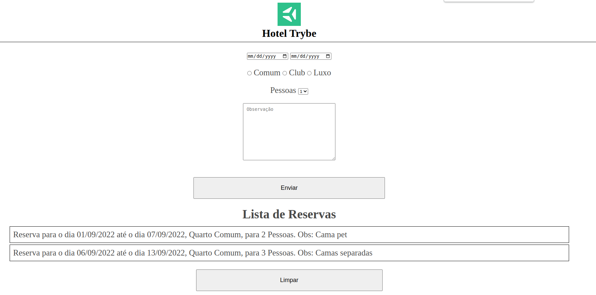

## Lógica de Programação com Forms e Local Storage - Academia de Lógica

### 1. Faça uma barra superior para o titulo e o logo
Utilize header para fazer a barra e deve conter a classe header-trybe  
Adicione um titulo  
Adicione uma imagem Para adicionar a imagem você pode utilizar esta url:  
https://encrypted-tbn0.gstatic.com/images?q=tbn:ANd9GcT3q0v72AJA-p9V_oPst_65uEG9dr1WxKN-ZYp_5gE&s  
 
### 2. Inicie um formulário que deve conter:  
Uma section com a classe hotel-form para a reserva do hotel  
Adicione um input do tipo data para o Checkin com a classe inputCheckin  
Adicione um input do tipo data para o Chekout com a classe inputCheckout  
Uma section com a classe hotel-form selecionarmos os tipos de quartos com  
Adicione um input do tipo radio para o quarto Comum com a classe bedroom  
Adicione um input do tipo radio para o quarto Club com a classe bedroom  
Adicione um input do tipo radio para o quarto Luxo com a classe bedroom  
Todos devem conter o mesmo name  
Uma section com a classe hotel-form para a quantidade de pessoas  
Adicione um select com quatro options de 1 ao 4 com a classe nPessoas  
Uma section com a classe hotel-form para escrevermos alguma observação  
Adicione uma textArea com placeholder para indicar que é o campo de observações com a classe obs  
Adicione um botão com o id submit-btn  
### 3. Lista de reservas  
Faça uma section com a classe list-section para a lista de reservas  
Adicione um titulo  
Adicione uma lista ordenada  
Adicione um botão com o id clear-btn  
### 4. Adicionando os valores dos inputs na lista  
Desenvolva uma função para criar uma li de forma dinâmica  
Sua li deve conter os valores dos inputs e ficar da seguinte forma: Reserva para o dia xx/xx/xxxx até o dia xx/xx/xxxx Quarto x -   Para x Pessoas - Obs: xxxx Obs: xxxxxx  
Esta li deve ser filha da ol  
Adicione um evento de click ao botão que deve receber essa função  
### 5.Limpando a lista  
Desenvolva uma função que deve limpar a lista  
Adicione um evento de click ao botão limpar lista que deve receber essa função  
### 6. Salvando a lista com LocalStorage  
Desenvolva uma função que deve salvar a lista quando alteramos algo nela  
Desenvolva uma função que deve restaurar a lista quando recarregarmos a pagina  
A função que restaura a lista deve ser chamada dentro do window.onload  

Resultado final:

